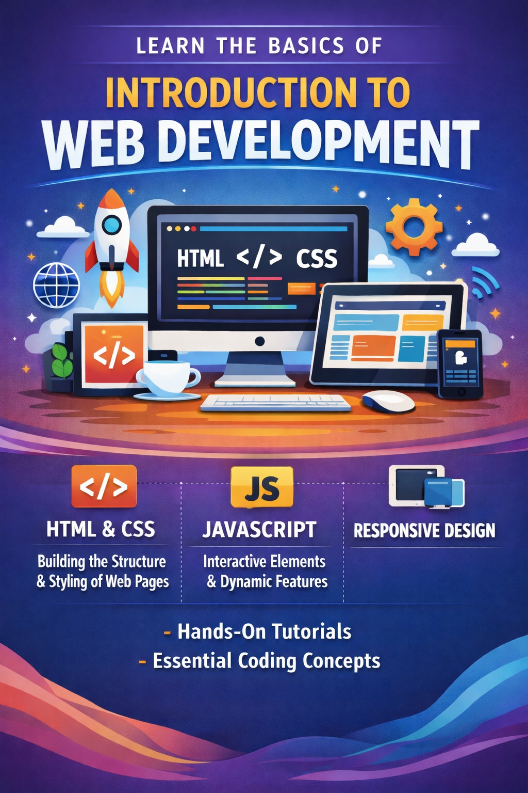

# LLM Agents

### Course Overview
This course introduces students to LLMs, agents and multi-agent systems.

- practical development of intelligent agents and applications powered by Large Language Models (LLMs). 
- Students will explore how LLMs can be orchestrated and integrated with external tools, APIs, and structured memory systems

- enable decision-making, problem-solving, and autonomous interaction across complex software engineering tasks. 

- A variety of application areas will be considered, for example including the use of LLM-based technologies to develop assistive systems. Application areas will include medical diagnosis, or to streamline resource allocation, hazard analysis and decision-making. 

- Core agent architectures, and retrieval-augmented agents will be examined through applied coding labs and project-based learning
- students will gain hands-on experience with agentic frameworks and prompt-augmentation techniques to build agents for a variety of purposes: searching the web, querying databases, controlling devices, composing workflows etc.

- Emphasis will be placed on the integration of LLMs in software engineering processes and practices, and on how to document this usage. 

- Taking a systems-centric view, students will learn the importance of understanding and bounding the behaviour of LLM-based agents in the wider system context
- how to evaluate and monitor agents’ behaviours, and how to use guardrails to frame their autonomy where necessary.

- Ethical and safety considerations, including agent alignment, hallucination control, and failure recovery, will also be addressed to ensure responsible deployment in real-world contexts.

## Resources

[deeplearning.ai course](https://learn.deeplearning.ai/courses/agent-skills-with-anthropic/lesson/ldn5c3/introduction)

**Level:** Undergraduate
**Prerequisites:** Basic programming knowledge (any language)  
**Duration:** 12 weeks (3 hours/week lecture + 2 hours/week lab)  

**Course Instructor:** Soumya Banerjee

**Course Website:** [https://neelsoumya.github.io/teaching_llm_agents/](https://neelsoumya.github.io/teaching_lm_agents/)

### Course Materials

Course content and materials can be found in the following files:

- [Resources](materials/resources.md)
- [Installation guide](materials/installation.md)
- [Skills](materials/claude.md)
- [Tools](materials/tools.md)
- [Agents](materials/agents.md)
- [MCP](materials/MCP.md)
- [Computer use](materials/computer_use.md)
- [Guardrails](materials/guardrails.md)
- [Evals](materials/evals.md)
- [Open source models and Ollama](materials/openweight_models.md)
- [Rapid prototyping](materials/rapid_prototyping.md)
- [Projects, exams and quizzes](materials/exams_and_quizzes.md)

<!--
### Instructor Information
 - [Extra information](materials/extra.md)
-->

### Learning Objectives

By the end of this course, students will be able to:
- Create multi-agent systems

### Course Structure

### Required Materials
- [Setup instructions](materials/setup.md)
- [Installation guide](materials/installation.md)
- Google Colab

### Acknowledgements

Generative AI was used to generate content for this course. All content was vetted and verified by the author.

### Support
- Office Hours: [TBD]
- Discussion Forum: [TBD]
- Teaching Assistants: [TBD]

### Instructor Information
- Name: Soumya Banerjee
- Email: [neel.soumya@gmail.com]
- [DeepWiki](https://deepwiki.com/neelsoumya/teaching_web_development)
- Website: [Webpage](https://neelsoumya.github.io/)
