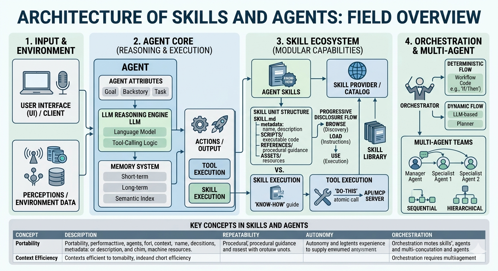
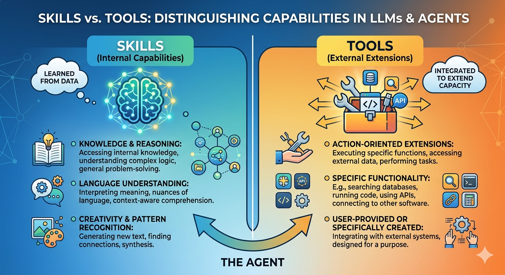
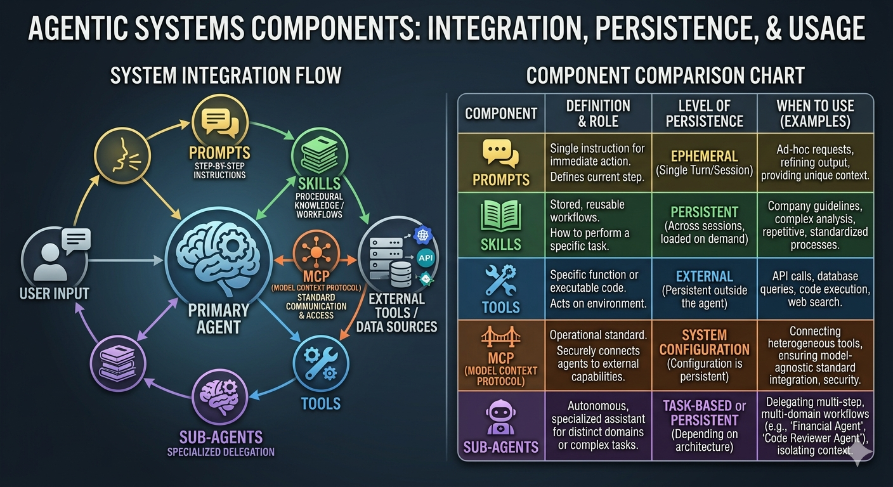

# Claude tools

- [Course webpage](https://learn.deeplearning.ai/courses/agent-skills-with-anthropic/lesson/bv2ekh/why-use-skills---part-i)

- Claude.ai/Claude Desktop, the Claude API, Claude Code, and the Claude Agent SDK

- [https://agentskills.io/home#adoption](https://agentskills.io/home#adoption)

- [material](https://github.com/https-deeplearning-ai/sc-agent-skills-files/tree/main)

## Skills

- [Lecture deeplearning.ai on skills](https://learn.deeplearning.ai/courses/agent-skills-with-anthropic/lesson/bv2ekh/why-use-skills---part-i)

- 📝 `SKILLS.md` File which should have the skills. This will have all the instructions to perform the tasks.

- `name` and `description` are required (YAML format)

- `references` folder should have file which is referenced in .md format

- put all these in another folder 📁 (named with the same name as the skill), zip it

- ⬆️📎 Upload this zipped file to _Claude_ > `capabilities` > `Skills`

- _Concept_ 🧩🚀 Skills are an open standard and are supported in `Claude`, `Gemini`, etc.

- [OpenAI SKILLS](https://developers.openai.com/cookbook/examples/skills_in_api)

- You want to keep system prompts slim. Put stable procedures in skills; keep system prompts for global behavior.

-  🧩🚀 Multiple agents or teams share the same _house style._ Skills are a nice `org standard library` pattern.

- Also good for _reproducibility_

- You want a reusable, independently versionable set of behaviours

- Consider pinning the model and skill version together for reproducible behavior across deployments.

- If the system prompt repeats the entire procedure, people will: Bypass skills and Stuff logic into tool schemas. And you lose the whole point (reusability + versioning + conditional invocation) of skills. Keep the system prompt content separate.

- Your workflow is highly conditional, or branches like a complex flow chart. Example: If X → do this; else if Y → do that; plus validation + retries.

- Skills are less ideal if it is a one-off task

- 🧩🚀  Skills are less ideal if you need live data side effects (that would be a `tool call`)

- [VibeSafe: reproducible prompts](https://github.com/lawrennd/vibesafe)

- Folder Structure for a Skill

A **skill** is just a folder bundle. A typical skill folder may contain:

```text
my-skill/
├── SKILL.md              # Required: main instruction file
├── scripts/              # Optional: code files
│   ├── example.py
│   └── example.js
├── helpers/              # Optional: helper modules and dependencies
│   └── requirements.txt
├── assets/               # Optional: images, data files, templates
│   ├── sample_input.json
│   └── template.md
└── README.md             # Optional: human-readable overview
```

- An example `SKILLS.md` file is here

```bash
---
name: academic-grant-writer
description: Transform Markdown notes (ideas, outlines, meeting notes) into a polished academic grant proposal in LaTeX with a corresponding BibTeX file.
version: 1.0
---

# Skill: Academic Grant Writing from Notes

## Purpose

Transform one or more Markdown inputs containing ideas, outlines, meeting notes, rough drafts, and reference fragments into a polished academic grant proposal written in LaTeX, with a matching BibTeX file.

## Input Format

The input directory may contain any of the following Markdown files:

- `ideas.md`
- `outline.md`
- `meeting-notes.md`
- `references.md`
- `draft.md`
- other `.md` files containing relevant project material

These files may be incomplete, repetitive, messy, or contradictory. Your job is to synthesize them into a coherent grant application.

## Output Format

Produce:

- `grant.tex` — the main LaTeX document
- `references.bib` — BibTeX entries for all cited sources
- optionally:
  - `sections/` for modular LaTeX files such as `sections/abstract.tex`, `sections/methods.tex`
  - `appendix.tex` if needed

The main output should be a clean, compile-ready LaTeX manuscript.

## Core Task

Use the Markdown notes to draft a grant proposal with the following qualities:

- clear research vision
- strong motivation and significance
- feasible work plan
- well-structured methodology
- explicit expected outcomes and impact
- academically polished language
- consistent terminology throughout

## Preferred Grant Structure

Unless the user specifies otherwise, use this structure:

1. Title  
2. Abstract  
3. Background and Motivation  
4. Research Questions / Aims  
5. Methodology / Work Packages  
6. Expected Contributions / Impact  
7. Timeline  
8. Risks and Mitigation  
9. References  

If the notes suggest a different funding format, adapt accordingly.

## Writing Rules

- Preserve the user’s intent and domain-specific terminology.
- Turn fragments into full academic prose.
- Do not invent claims, results, or citations.
- Flag uncertainty where the notes are ambiguous.
- Prefer precise, formal, grant-style language.
- Remove redundancy and combine repeated ideas.
- Keep the proposal internally consistent.
- Make the narrative persuasive but not overstated.

## Citation Rules

- Any factual claim that depends on external literature should be supported by a BibTeX entry.
- If a reference is mentioned in the notes but incomplete, do one of:
  - infer the likely citation only if highly confident, or
  - mark it clearly as `TODO` in the BibTeX file.
- Never fabricate publication details.
- Ensure every in-text citation key used in `grant.tex` exists in `references.bib`.

## LaTeX Rules

- Use standard, minimal LaTeX packages unless the grant format requires otherwise.
- Keep the document compile-ready.
- Prefer semantic structure:
  - `\section{}`
  - `\subsection{}`
  - `\paragraph{}`
- Use `\cite{}` for references.
- Avoid overcomplicated macros unless useful.
- If equations, tables, or figures are needed, include them only when supported by the notes.

## BibTeX Rules

- Extract all explicit references from the notes.
- Consolidate duplicate citations into one canonical entry.
- Use consistent BibTeX keys, for example:
  - `smith2022robustness`
  - `doe2021multiagent`
- If a citation is known only partially, keep the entry marked clearly for later completion.

## Workflow

1. Read all Markdown inputs.  
2. Identify:
   - project goal  
   - research problem  
   - contributions  
   - methods  
   - required references  
   - missing information  
3. Draft a concise but compelling grant narrative.  
4. Convert all bibliographic mentions into BibTeX entries.  
5. Write the final LaTeX and BibTeX outputs.  
6. Check consistency:
   - names  
   - acronyms  
   - citations  
   - section ordering  
   - terminology  
7. Ensure the output compiles cleanly.

## Style Guidance

Write in a tone that is:

- professional  
- precise  
- credible  
- concise  
- academically persuasive  

Avoid:

- hype  
- vague language  
- unsupported promises  
- repetitive phrasing  
- overlong sentences  

## Handling Incomplete Notes

When the notes are incomplete:

- infer structure from context  
- keep placeholders for unknown details  
- make assumptions explicit only when necessary  
- prefer conservative, defensible wording over guesswork  

Examples of acceptable placeholders:

- `[FUNDING SCHEME]`  
- `[PROJECT DURATION]`  
- `[NAME OF HOST INSTITUTION]`  
- `[REFERENCE NEEDED]`  

## Quality Checklist

Before finishing, verify:

- the proposal has a clear argument  
- the research questions are explicit  
- the work plan is feasible  
- citations match bibliography entries  
- the LaTeX is syntactically valid  
- no important note content was omitted  
- no unsupported claims were added  

## Output Expectations

The final deliverable should feel like a real grant draft, not a summary of notes.

When possible, prefer:

- full sentences over bullet lists  
- narrative synthesis over raw extraction  
- coherent sections over fragmented notes  
```


## Why use skills and how they work

- [Video by Anthropic](https://learn.deeplearning.ai/courses/agent-skills-with-anthropic/lesson/eg4sac/why-use-skills---part-ii)

- Model Context Protocol (MCP)

- 🤔❓ Verifiability, how to prove correctness

- 🤔❓ Trust, fairness. Something like model cards or nutrition labels?


## 🎮 Exercise

- [CMBAgent](https://github.com/CMBAgents/cmbagent)

- [AG2](https://github.com/ag2ai/ag2)


- code [`deep_research_agent_ag2.ipynb`: Deepresearch agent to re-envision AI and trip planning](https://github.com/neelsoumya/intro_to_LMMs/blob/main/deep_research_agent_ag2.ipynb)


## Tools

- Claude (in the UI click on the `+` button and add the skill you included. For example, `\academic-grant-writer`)

- Github codespaces

- Google colab codespaces

- VSCode/ Azure Skills

- VSCode `/create-skill` command

- Example (in the prompt window in `VSCode`)

```html
/create-skill this skill will produce a grant text in latex (.latex file and .bib file) give meeting notes and outlines in .md and .txt format
```

## Skills are composable

- Skills for marketting analysis can be combined with skills for generating excel sheets

- Combine them to create workflows

- Predictable output from non-deterministic systems

- _Concept_: 🧩🚀 Progressive disclosure. Do not pollute the context window. Load only what is required.

## Architecture of skills and tools

- Skills

- Tools

- Humans as orchestrators




## Agent skills in Claude

- [Lecture](https://learn.deeplearning.ai/courses/agent-skills-with-anthropic/lesson/9iovmn/skills-vs-tools%2C-mcp%2C-and-subagents)


## Skills vs. Tools

 > Think of a skill as the agent’s talent and a tool as its toolbox. A skilled carpenter (the agent) knows how to build a house (skill), but they still need a hammer (tool) to drive the nails. If you give a hammer to someone who doesn't know how to build, you just end up with a very dented wall.

 - In the world of agentic design, the distinction between skills and tools is essentially the difference between _brainpower_ and _equipment_. While they often work in tandem, their roles in an agent's architecture are distinct.

 - The Tools are the knives, ovens, and blenders. They are available for any chef to use for a specific, simple function.

- The Skills are the recipes and techniques (e.g., "how to sauté" or "how to bake a soufflé"). 

- Having the oven (tool) doesn't mean you know the 10-step process of timing and temperature required to make the soufflé (skill).

- Tools often fail because the agent doesn't know when or how to use them. 

- Skills provide the _guardrails_ and logic to ensure tools are used correctly.




## Subagents

## Integrations

- Github

- Google Drive

- Slack

## Prompts

- Most atomic unit

## Context window

- Context window as a public good

## Summary of differences between agents, skills, prompts and MCP



---

### **Agentic Components: At a Glance**

| Component | Role | Persistence | Best Used For... |
| :--- | :--- | :--- | :--- |
| **Prompts** | The immediate "What" and "How." | **Ephemeral** (Single turn/session) | Providing context, specific formatting, or one-off logic. |
| **Skills** | Procedural "How-to" knowledge. | **Persistent** (Library/Config) | Standardizing repetitive workflows (e.g., "Analyze this dataset"). |
| **Tools** | Functional "Hands" (APIs, Code). | **External** (Built into the environment) | Interacting with the real world (e.g., searching the web, sending emails). |
| **MCP** | The universal "Connector." | **System-Level** (Infrastructure) | Connecting an agent to diverse data sources via a standard protocol. |
| **Sub-agents** | The "Specialists." | **Task-Based** (Duration of workflow) | Delegating complex, multi-step tasks to a focused "expert" model. |

---

### 🧩🚀 **Key Concepts**

#### **1. The Hierarchy of Persistence**
* **Prompts** are the most fluid. They live and die within a conversation window. If you want an agent to "remember" a behavior forever without typing it every time, you move that logic into a **Skill**.
* **Tools** and **MCP** connections are foundational. They are configured once at the system level and remain available across all sessions, much like installing software on a computer.

#### **2. The "Hand-off" Workflow**
In a sophisticated system, the **Primary Agent** receives a **Prompt**, recognizes it doesn't have the data (via **MCP**), realizes the task is too complex for one step, and spins up a **Sub-agent**. That sub-agent uses a specific **Skill** (procedural knowledge) to execute a **Tool** (the action).

#### **3. Why MCP Matters Now**
Before the **Model Context Protocol (MCP)**, connecting an agent to a new database or service required custom "glue code" for every single tool. MCP acts like a universal USB port—it allows the agent to plug into a standardized server that can provide tools and resources regardless of the specific LLM being used.

#### **4. Skills vs. Tools (The common point of confusion)**
* **A Tool** is the *hammer*: It’s the actual code that hits an API or executes a Python script.
* **A Skill** is the *carpentry knowledge*: It’s the set of instructions that tells the agent *when* and *how* to swing that hammer to build a specific thing.

---

> **Tip:** "Agentic" isn't just about the model being smart—it's about the model having the **agency** to choose between these components to solve a problem.


## 🎮🛠️ Exercise: Web Search + Summaries + Error Logging Agent

- Read [advanced agents](agents_advanced.md)

1. Objective
   - Build a Claude-style agent that performs a web search, generates a short summary, and logs errors for inspection.

2. Required toolchain
   - `web_search(query: str) -> list[dict]` (title/url/snippet)
   - `summarize_text(text: str) -> str`
   - `log_error(error_details: str) -> str`

3. Behavior pattern
   - Ask clarifying question if input is underspecified.
   - Pick a concise search query and call `web_search`.
   - Find the top 3 sources; for each source:
     - fetch body text (simulate or use real scraper)
     - call `summarize_text`
   - Compose a final answer with:
     - key facts and sources
     - “confidence level” marker
   - On any exception or missing data, call `log_error` and continue gracefully.

4. Prompt scaffold (Claude recommended)
   - System: "You are a helpful research assistant. Use tools for facts, summarize clearly, and log any errors for auditing. Keep final answers short."
   - User: "Find the latest techniques for improving retention in adult learning programs. Provide a summary and source links."

5. Evaluation criteria
   - correctness of output format
   - use of tool calls and summaries
   - presence of error log statements for simulated failures
   - final answer clarity and citation

6. Extra credit
   - Add a retry strategy for transient `web_search` failures (exponential backoff)
   - Add a optional `verify_with_secondary_source()` step before final answer
   - Add a `safe_query()` option for safe search


## Pre-built skills

- [Video](https://learn.deeplearning.ai/courses/agent-skills-with-anthropic/lesson/cniu9q/exploring-pre-built-skills)

- Skill creator

- PDF and Excel, can also call 🐍 Python programs

- `scripts` folder

- Example Skills in _Claude_

- Use BigQuery MCP server to get data

- Consistent styling and logos in skills (_assets_ folder)

- ⚠️ Clear and concise, 500 words and use forward slash (`/`)

- ⚠️ `scripts`, `references` and `assets` folders


